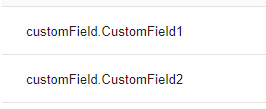
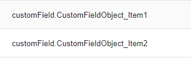

# HelloID-Conn-Prov-Target-StudyTube

<p align="center">
  
</p>

## Table of contents

- [HelloID-Conn-Prov-Target-StudyTube](#helloid-conn-prov-target-studytube)
  - [Table of contents](#table-of-contents)
  - [Introduction](#introduction)
  - [Steps to proceed](#steps-to-proceed)
    - [FieldMapping](#fieldmapping)
      - [Single Value](#single-value)
      - [Key-Value](#key-value)
    - [Create Script](#create-script)
    - [Update Script](#update-script)
      - [Correlated Account mapping](#correlated-account-mapping)
      - [Compare](#compare)
        - [Compare CustomField Single Value](#compare-customfield-single-value)
        - [Compare CustomField Key-Value](#compare-customfield-key-value)
        - [Add to JsonBody](#add-to-jsonbody)
      - [Add field to AuditLogs](#add-field-to-auditlogs)
    - [More Documentation](#more-documentation)


## Introduction
The StudyTube API supports the use of custom fields. The current connector code does not implement custom fields, but to make it easy to implement custom fields in the current code, this document describes how to proceed. In this document, two types of custom fields are added as examples: `Key-Value` and `Single Value`. The examples use **hardcoded** values, so each time you add a custom field in the field mapping, you should also update the PowerShell code accordingly.


## Steps to proceed

### FieldMapping
Custom fields can be added to the field mapping as shown in the image below. The object `CustomField` should be excluded from the account object while creating or updating. The connector should convert the CustomFields into a key-value pair array, which is accepted by the API.

#### Single Value
An example of a `FieldMapping` for a `Single-Value` custom field.



#### Key-Value
The HelloID `fieldMapping` is one level deep. To create an object one level deeper, the example uses an underscore ('_') as a separator. An example of a `FieldMapping` for a `Key-Value` custom field.




### Create Script
In the create process, the mapping should be modified from the FieldMapping to the Body, which should be accepted by the API. The variable jsonBody contains the JSON body that needs to be sent to the API.

```Powershell
Write-Information 'Create Http Request body'
if ($null -ne $actionContext.data.customField) {
    $bodyObject = $actionContext.Data | Select-Object * -ExcludeProperty customField
    $bodyObject | Add-Member @{
        academy_user_custom_fields = [System.Collections.Generic.List[object]]::new()
    }

    # Processing Single Value
    foreach ($customField in $actionContext.data.customField.PSObject.Properties | Where-Object { $_.name -notmatch 'CustomFieldObject' } ) {
        Write-Information "Adding CustomField: [key=$($customField.name); value=$($customField.value)]"
        $bodyObject.academy_user_custom_fields.Add(@{
                key   = $customField.name
                value = @( "$($customField.value)")
            })
    }

    # Processing Key Value # CustomFieldObject
    $employmentProperties = $actionContext.data.customField.PSObject.Properties | Where-Object { $_.name -match 'CustomFieldObject' }
    if ($null -ne $employmentProperties ) {
        $employmentData = @{}
        foreach ($property in $employmentProperties) {
            $key = $property.name -split 'CustomFieldObject' | Select-Object -Last 1
            $employmentData[$key] = $property.Value
        }
        $bodyObject.academy_user_custom_fields.Add(@{
                key   = 'CustomField'
                value = @($employmentData)
            })
    }
    $jsonBody = ConvertTo-Json -InputObject $bodyObject -Depth 10
} else {
    $jsonBody = $actionContext.Data | ConvertTo-Json -Depth 10
}
```

### Update Script
In the update script, the connector should do the following:

- Map the correlated account properties to the field mapping and add it to $outputContext.PreviousData.
- Compare PreviousData against $actionContext.Data.
- Add the changed CustomFields to the body to update the account in StudyTube.
- Show the changed CustomFields in the audit logs.

#### Correlated Account mapping
```Powershell
# Add CustomFields values from correlated account in PreviousData
$CustomFieldObject = ($correlatedAccount.academy_user_custom_fields | Where-Object { $_.key -eq 'CustomFieldObject' }).Value
$outputContext.PreviousData | Add-Member @{
    customField = [PSCustomObject]@{
        Item1                   = "$(($correlatedAccount.academy_user_custom_fields | Where-Object { $_.key -eq 'Item1' }).Value | Select-Object -First 1)"
        Item2                   = "$(($correlatedAccount.academy_user_custom_fields | Where-Object { $_.key -eq 'Item2' }).Value | Select-Object -First 1)"
        CustomFieldObject_Item1 = $CustomFieldObject.Item1
        CustomFieldObject_Item2 = $CustomFieldObject.Item2
    }
} -Force
```

#### Compare
Exclude the object CustomField from the Fieldmapping for the 'normal' comparison
```Powershell
$splatCompareProperties = @{
    ReferenceObject  = @($outputContext.PreviousData.PSObject.Properties)
    DifferenceObject = @(($actionContext.Data | Select-Object * -ExcludeProperty customField).PSObject.Properties)
}
```

##### Compare CustomField Single Value
```Powershell
if ($null -ne $actionContext.data.customField) {
    Write-Information 'Compare the customFields from field mapping against current StudyTube account'
    $splatCustomCompareProperties = @{
        ReferenceObject  = @(($outputContext.PreviousData.customField | Select-Object * -ExcludeProperty SideIndicator).PSObject.Properties)
        DifferenceObject = @(($actionContext.Data.customField | Select-Object * -ExcludeProperty SideIndicator).PSObject.Properties)
    }
    $customFieldChanged = Compare-Object @splatCustomCompareProperties -PassThru | Where-Object { $_.SideIndicator -eq '=>' }
    $academy_user_custom_fields = [System.Collections.Generic.List[object]]::new()

    foreach ($customFieldChange in $customFieldChanged | Where-Object { $_.Name -NotMatch 'CustomFieldObject' }) {
        Write-Information  "CustomField Changed: [key=$($customFieldChange.name); value=$($customFieldChange.value)]"
        $academy_user_custom_fields.Add(@{
                key   = $customFieldChange.name
                value = @($customFieldChange.value)
            })
    }
}
```

##### Compare CustomField Key-Value
```Powershell
if ($null -ne $actionContext.data.customField) {
    if ($customFieldChanged.name -match 'CustomFieldObject' ) {
        $employmentBody = @{
            Item1    = $outputContext.PreviousData.customField.CustomFieldObject_Item1
            Item2     = $outputContext.PreviousData.customField.CustomFieldObject_Item2
        }
        foreach ($change in $customFieldChanged | Where-Object { $_.Name -match 'CustomFieldObject' } ) {
            $name = $change.name.Split('_') | Select-Object -Last 1
            $employmentBody["$name"] = $change.Value
        }

        $academy_user_custom_fields.Add(@{
                key   = 'CustomFieldObject'
                value = @($employmentBody)
            })
    }
}
```
##### Add to JsonBody
If changed, add `academy_user_custom_fields` to the `jsonBody`.
```Powershell
if ( $academy_user_custom_fields.Count -gt 0) {
    $propertiesChanged['academy_user_custom_fields'] = $academy_user_custom_fields
}
```

#### Add field to AuditLogs
```Powershell
# Add Sub Properties to propertiesChanged to show the updated properties in the audit log.
if ($propertiesChanged.Keys -match 'academy_user_custom_fields') {
    foreach ($field in $customFieldChanged) {
        $propertiesChanged["$($field.name)"] = $field.Value
    }
    $propertiesChanged.Remove('academy_user_custom_fields')
}
```

### More Documentation
The Supplier documentation can be found here: [Documentation](https://public-api.studytube.nl/api/v2/docs#/users/putApiV2UsersUseridCustomFields)


